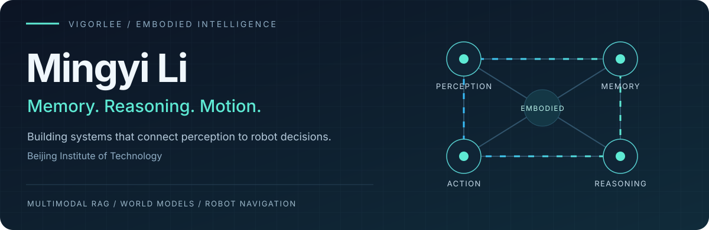
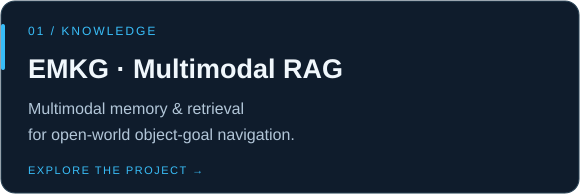
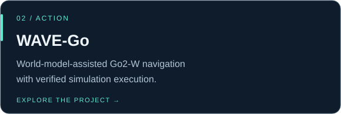
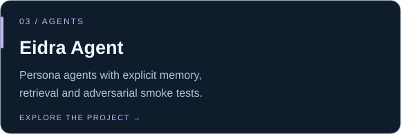
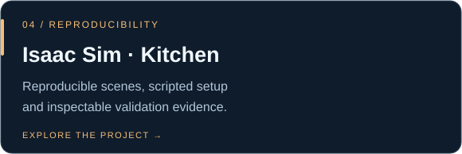

**Embodied AI · Multimodal Reasoning · Robot Navigation**

[Research & projects](#selected-work) · [Interactive explorer](#explore) · [Simulation results](#from-models-to-motion) · [Contact](mailto:limingyi@bit.edu.cn)

 

Total Stars = stars received across my public repositories, not repositories I have starred. Updated by the badge service; GitHub image caching can delay changes.

I build embodied AI systems that connect **multimodal perception → structured memory → grounded decisions → robot execution**. I am with **Beijing Institute of Technology**, working on multimodal retrieval, world-model-assisted autonomy and reproducible robotics.

## Selected work

<table>
<tr>
<td width="50%" valign="top">
 

</td>
<td width="50%" valign="top">
 

</td>
</tr>
<tr>
<td width="50%" valign="top">
 

</td>
<td width="50%" valign="top">
 

</td>
</tr>
</table>

## Explore

**Choose a direction — click to open. / 点击展开，探索我的研究方向。**

<b>01 · How can a robot remember what it sees? / 感知与记忆</b>

### From observations to useful memory

I explore semantic-spatial memory and multimodal retrieval for open-world object-goal navigation: visual observations become evidence that a robot can retrieve and use when choosing where to go.

**Explore:** [EMKG / Multimodal RAG](https://github.com/vigorlee/Multimodal--RAG)

`Multimodal RAG` · `ObjectNav` · `Vision-language models` · `Structured memory`

<b>02 · How do model decisions become robot motion? / 决策与执行</b>

### From a high-level task to verified execution

WAVE-Go connects world-model-assisted decisions with navigation and Go2-W control. Its two workflows cover map-independent charging and hybrid long-range navigation. In the latter, Cosmos3-Edge chooses an approved route; Nav2/RoamerX handles navigation, and DreamWaQ controls motion.

**Explore:** [WAVE-Go](https://github.com/vigorlee/wave-go) · [Three-scenario simulation evidence](https://github.com/vigorlee/wave-go/tree/main/demos/go2w-cosmos-extended-navigation/evidence/2026-09-10)

`World models` · `Robot navigation` · `Go2-W` · `Verified execution`

<b>03 · How can agent memory stay inspectable? / 智能体与可复现性</b>

### Make memory and experiments easier to inspect

Eidra Agent explores explicit memory, retrieval and adversarial smoke tests for persona agents. My simulation work also focuses on scripted setup, asset checks and clear validation evidence.

**Explore:** [Eidra Agent](https://github.com/vigorlee/eidra-agent) · [Isaac Sim Kitchen](https://github.com/vigorlee/lightwheel-kitchen-isaacsim-repro) · [Room runtime](https://github.com/vigorlee/Room)

`Agent memory` · `Retrieval` · `Isaac Sim` · `Reproducible experiments`

## From models to motion

**18/18 stages · 60.88 m · 3 scenario types** — stairs, ramps, and flat-ground obstacles with moving cylinder proxies. Recorded in MuJoCo / Unreal Engine on September 10, 2026. These are simulation results with sensor/model-fused obstacle data, not a real-robot benchmark.

[Inspect the results →](https://github.com/vigorlee/wave-go/tree/main/demos/go2w-cosmos-extended-navigation/evidence/2026-09-10)

---

**Clear boundaries. Reproducible setup. Inspectable evidence.**

Beijing Institute of Technology · [limingyi@bit.edu.cn](mailto:limingyi@bit.edu.cn) · [All repositories](https://github.com/vigorlee?tab=repositories)

Built with GitHub-native expandable sections, clickable project cards and an animated SVG. [How the live statistics work](PROFILE.md).

